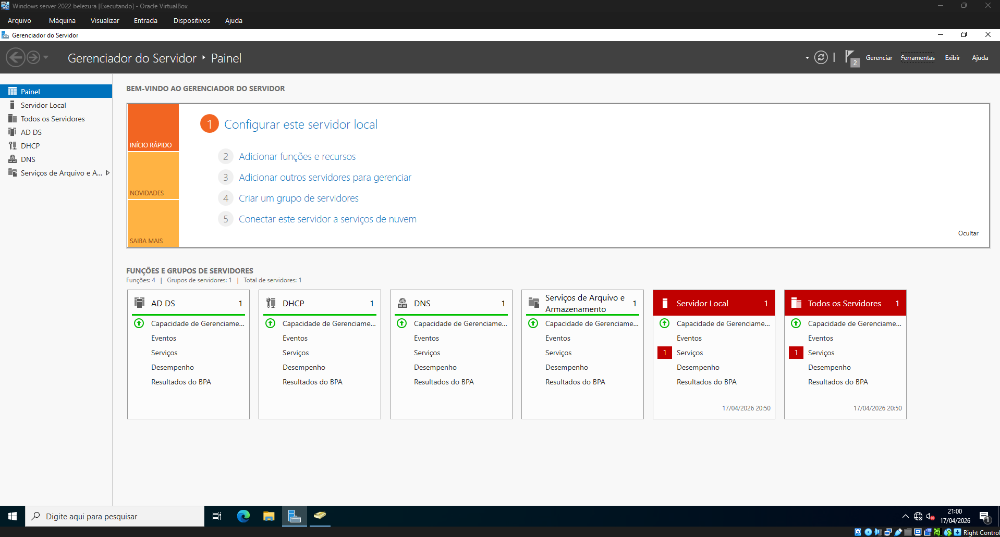
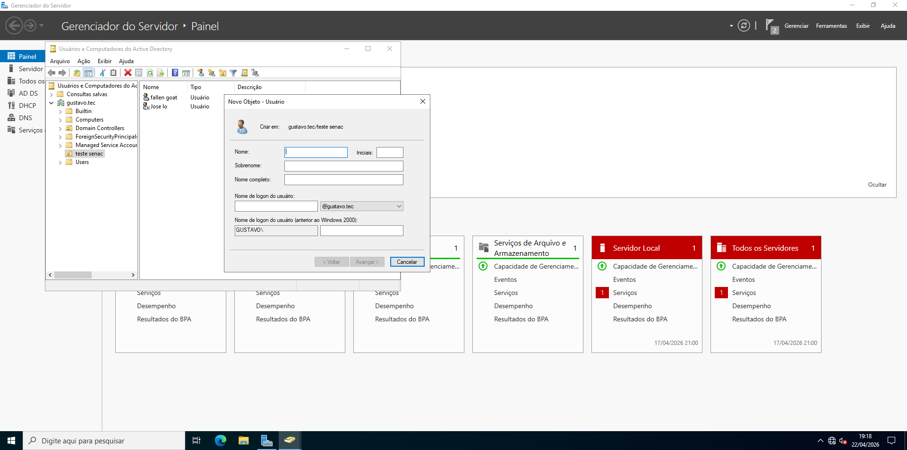
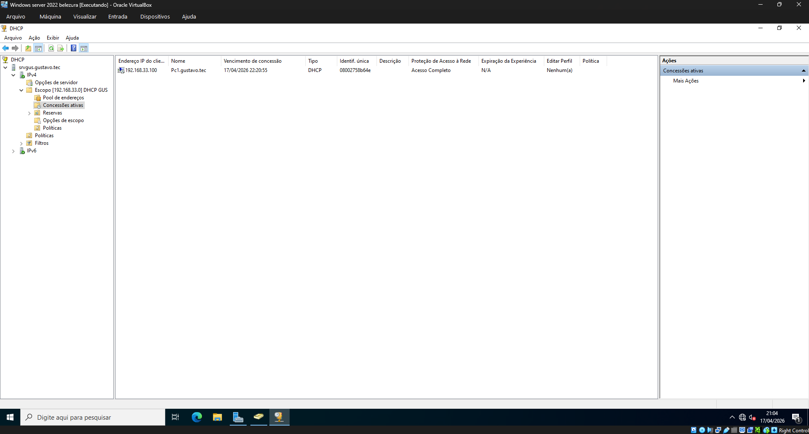
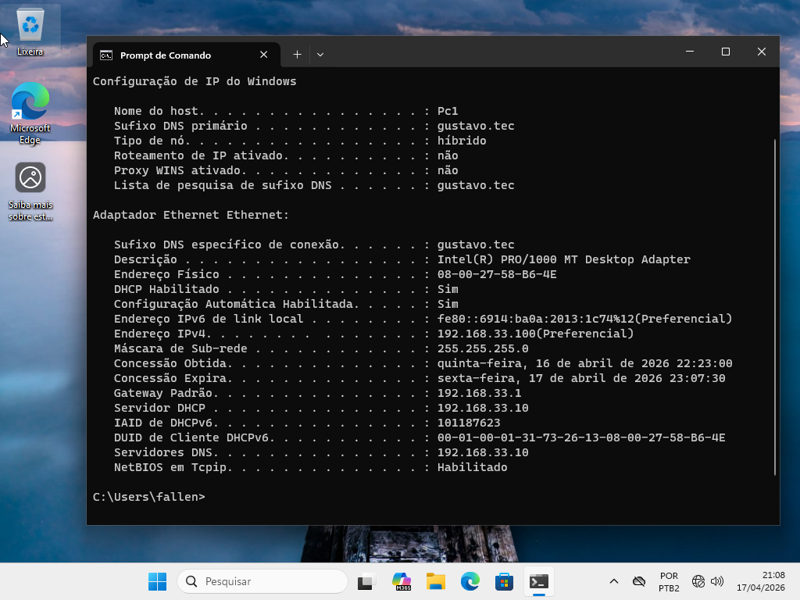
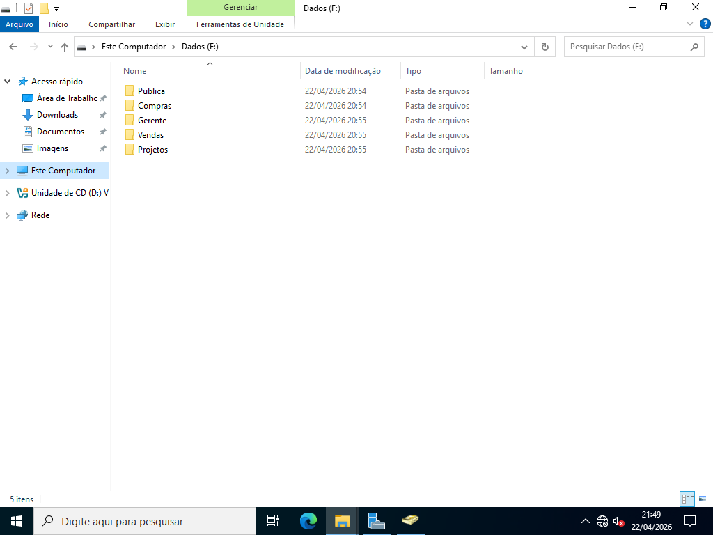
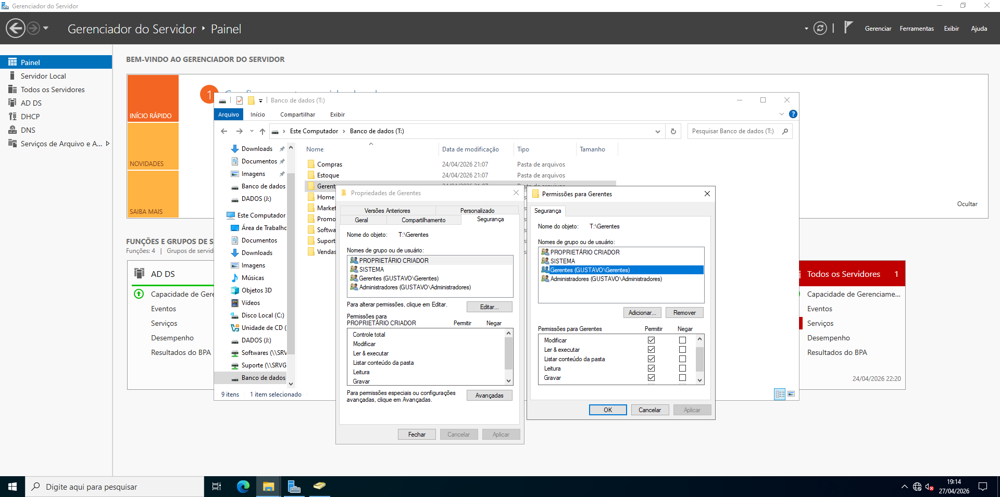
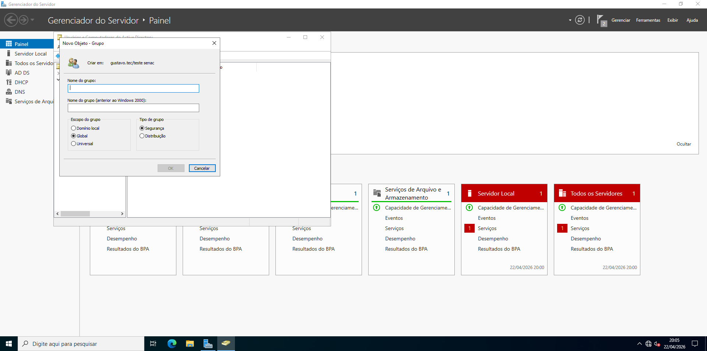

# 📡 Projeto: Servidor Windows Server 2022

## 📖 Descrição

Este projeto demonstra a implementação de um ambiente de rede utilizando o **Windows Server 2022**, com foco em:

* Active Directory (AD DS)
* Criação e gerenciamento de usuários
* Bloqueio de contas
* Configuração de DHCP
* Integração com máquina cliente (Windows 11)

O ambiente foi virtualizado utilizando o **Oracle VirtualBox**.

---

## 🖥️ Estrutura do Ambiente

| Componente    | Descrição           |
| ------------- | ------------------- |
| Servidor      | Windows Server 2022 |
| Cliente       | Windows 11          |
| Virtualização | Oracle VirtualBox   |
| Serviços      | AD DS, DHCP, DNS e Serviços de Arquivo e Armazenamento    |

---

## ⚙️ Etapas do Projeto

### 1️⃣ Instalação de Funções e Recursos

1. Acesse o **Gerenciador do Servidor**
2. Clique em **Adicionar funções e recursos**
3. Selecione:

   * AD DS
   * DHCP
4. Finalize a instalação

---

### 2️⃣ Promoção a Controlador de Domínio

1. Clique em **Promover este servidor a um controlador de domínio**
2. Escolha:

   * **Adicionar nova floresta**
3. Defina o domínio (ex: `gustavo.tec`)
4. Configure a senha DSRM
5. Reinicie o servidor

---

### 3️⃣ Criação de Usuários

1. Acesse **Usuários e Computadores do Active Directory**
2. Vá até a pasta **Users**
3. Clique em **Novo → Usuário**
4. Preencha os dados e defina a senha

---

### 4️⃣ Bloqueio de Usuário

1. Clique com botão direito no usuário
2. Vá em **Propriedades**
3. Aba **Conta**
4. Marque **Conta desabilitada**

💡 Ao tentar login, o sistema exibirá:

> "Sua conta foi desativada. Contate o administrador do sistema."
> 

---

### 5️⃣ Configuração do DHCP

1. Acesse o **DHCP**
2. Clique em **IPv4 → Novo Escopo**
3. Configure:

   * Intervalo de IP (ex: `192.168.33.100 - 192.168.33.200`)
   * Máscara de sub-rede
   * Gateway
   * DNS
4. Ative o escopo

---

### 6️⃣ Teste com Cliente

* Cliente configurado para obter IP automaticamente
* IP atribuído via DHCP
* Máquina ingressada no domínio

📌 Exemplo:

* IP: `192.168.33.100`
* Host: `pc1.gustavo.tec`

---

## 📁 7️⃣ Configuração do Servidor de Arquivos

### 🔧 Instalação do Serviço

1. Acesse o **Gerenciador do Servidor**
2. Clique em **Adicionar funções e recursos**
3. Avance até **Funções de Servidor**
4. Expanda:

   * **Serviços de Arquivo e Armazenamento**
   * **Serviços de Arquivo e iSCSI**
5. Marque:

   * ✔️ **Servidor de Arquivos**
6. Avance e finalize a instalação

---

### 📂 Criação das Pastas Compartilhadas

1. Crie as pastas no servidor, por exemplo:
2. Clique com botão direito na pasta → **Propriedades**
3. Vá na aba **Compartilhamento**
4. Clique em **Compartilhamento Avançado**
5. Marque **Compartilhar esta pasta**
6. Defina um nome de compartilhamento (ex: `Gerentes`)

---

### 🔐 Configuração de Permissões

#### Permissão de Compartilhamento

1. Clique em **Permissões**
2. Remova **Everyone**
3. Adicione o grupo ou usuário correto (ex: `Gerentes`)
4. Defina as permissões conforme necessário

---

#### Permissão NTFS (Segurança)

1. Vá na aba **Segurança**
2. Clique em **Editar**
3. Adicione o grupo correspondente
4. Configure:

   * Leitura
   * Modificação
   * Controle total

💡 Exemplo:

| Pasta     | Grupo          | Permissão      |
| --------- | -------------- | -------------- |
| Gerentes  | Gerentes   | Controle Total |
| Projetos  | Projetos   | Modificação    |
| Compras   | Compras    | Modificação    |
| Vendas    | Vendas     | Modificação    |

---

### 👥 Organização com Grupos

1. Acesse **Usuários e Computadores do Active Directory**
2. Crie grupos:

   * `Gerentes`
   * `Projetos`
   * `Compras`
   * `Vendas`
3. Adicione os usuários aos grupos correspondentes
4. Utilize os grupos nas permissões das pastas

---

## 🔐 Testes Realizados

* ✔️ Criação de usuário
* ✔️ Login no domínio
* ✔️ Bloqueio de conta
* ✔️ DHCP funcionando
* ✔️ Comunicação cliente-servidor

---

