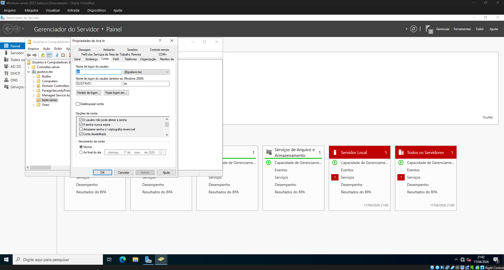
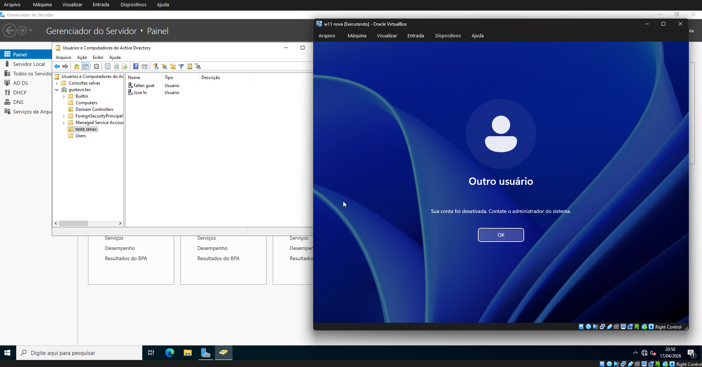

# 📡 Projeto: Servidor Windows Server 2022

## 📖 Descrição

Este projeto demonstra a implementação de um ambiente de rede utilizando o **Windows Server 2022**, com foco em:

* Active Directory (AD DS)
* Criação e gerenciamento de usuários
* Bloqueio de contas
* Configuração de DHCP
* Integração com máquina cliente (Windows 11)

O ambiente foi virtualizado utilizando o **Oracle VirtualBox**.

---

## 🖥️ Estrutura do Ambiente

| Componente    | Descrição           |
| ------------- | ------------------- |
| Servidor      | Windows Server 2022 |
| Cliente       | Windows 11          |
| Virtualização | Oracle VirtualBox   |
| Serviços      | AD DS, DHCP, DNS    |

---

## ⚙️ Etapas do Projeto

### 1️⃣ Instalação de Funções e Recursos

1. Acesse o **Gerenciador do Servidor**
2. Clique em **Adicionar funções e recursos**
3. Selecione:

   * AD DS
   * DHCP
4. Finalize a instalação

📷

---

### 2️⃣ Promoção a Controlador de Domínio

1. Clique em **Promover este servidor a um controlador de domínio**
2. Escolha:

   * **Adicionar nova floresta**
3. Defina o domínio (ex: `gustavo.tec`)
4. Configure a senha DSRM
5. Reinicie o servidor

---

### 3️⃣ Criação de Usuários

1. Acesse **Usuários e Computadores do Active Directory**
2. Vá até a pasta **Users**
3. Clique em **Novo → Usuário**
4. Preencha os dados e defina a senha

📷

---

### 4️⃣ Bloqueio de Usuário

1. Clique com botão direito no usuário
2. Vá em **Propriedades**
3. Aba **Conta**
4. Marque **Conta desabilitada**

📷

💡 Ao tentar login, o sistema exibirá:

> "Sua conta foi desativada. Contate o administrador do sistema."
> 

---

### 5️⃣ Configuração do DHCP

1. Acesse o **DHCP**
2. Clique em **IPv4 → Novo Escopo**
3. Configure:

   * Intervalo de IP (ex: `192.168.33.100 - 192.168.33.200`)
   * Máscara de sub-rede
   * Gateway
   * DNS
4. Ative o escopo

📷

---

### 6️⃣ Teste com Cliente

* Cliente configurado para obter IP automaticamente
* IP atribuído via DHCP
* Máquina ingressada no domínio

📌 Exemplo:

* IP: `192.168.33.100`
* Host: `pc1.gustavo.tec`

---

## 🔐 Testes Realizados

* ✔️ Criação de usuário
* ✔️ Login no domínio
* ✔️ Bloqueio de conta
* ✔️ DHCP funcionando
* ✔️ Comunicação cliente-servidor

---

